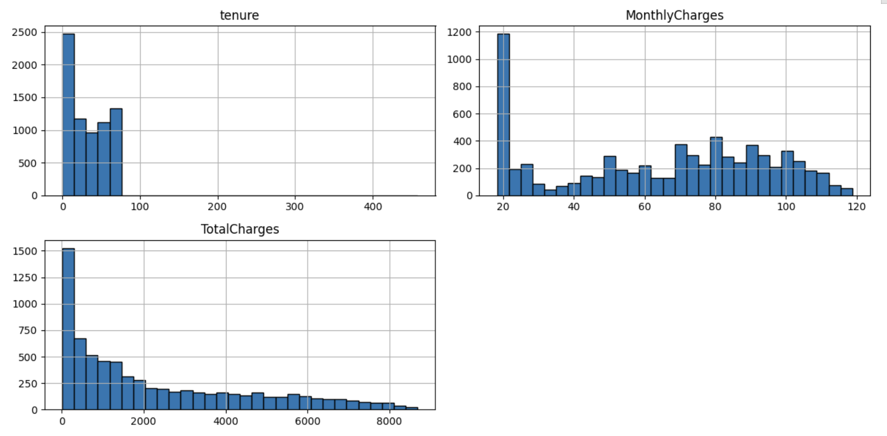

# Preventing Customer Churn Through Machine Learning

## Project Overview  
This project focuses on analyzing a telecom dataset to identify key drivers of customer churn and build a machine learning model to predict churn.  
The business goal is to understand why customers are leaving and provide data-driven recommendations to improve retention.  

## Business Case  
Customer churn is a major challenge in the telecom industry. Reducing churn directly improves profitability.  
As a Business Analyst, my role was to evaluate churn drivers, build predictive models, and provide actionable insights for retention strategies.  

## Approach  
1. **EDA** – distributions, churn by demographics & contracts  
2. **Feature Engineering** – missing values, encoding, scaling  
3. **Modeling** – Decision Tree in PySpark, tuned `maxDepth`, evaluated with AUC  
4. **Insights** – contract type, tenure, and monthly charges are key churn drivers 

## Key Results  
- Optimal decision tree depth: **7** (balanced underfitting & overfitting)  
- Feature importance revealed **contract length, tenure, and monthly charges** as top churn drivers  
- Recommended offering incentives for long-term contracts to reduce churn  

## Tools & Skills  
- **PySpark** for big data processing  
- **Machine Learning** (Decision Trees)  
- **EDA & Feature Engineering**  
- **Data Visualization** (Matplotlib, Plotly, Seaborn)  
- **Business Analysis** for actionable recommendations  

## Visuals  
### Some images from the project

### Feature Importance Plot:

### Churn Distribution by Contract: 

## Certificate

[Certificate of Completion from Coursera](https://coursera.org/share/e0d6590f1bed54ef018b33be3777bd14)

---

## Full data analysis code in python is found 
[here](https://github.com/rishi-analytics/Machine-Learning-With-PySpark/blob/main/Machine_Learning_With_PySpark.ipynb)

